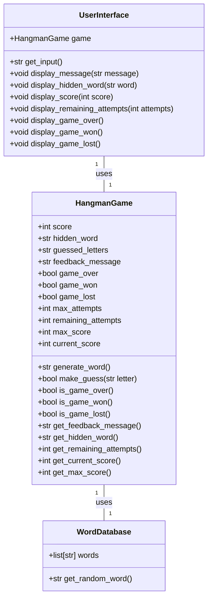
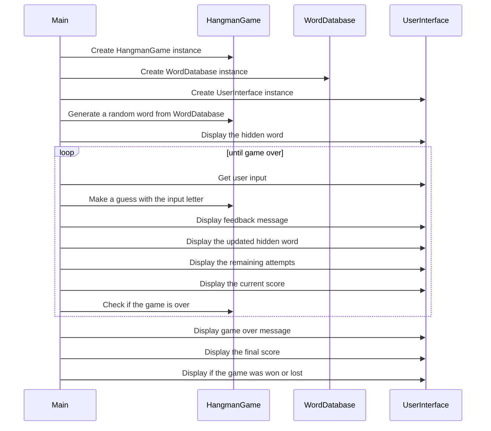

## Implementation approach:
For the Hangman game implementation, we will use the following approach:
1. Use Python's string manipulation functions to handle the hidden word and the player's guesses.
2. Implement a scoring system using a variable to track the player's score.
3. Use a user-friendly interface library to create a graphical user interface (GUI) for easy interaction.
4. Utilize an open-source word database to generate random words for the game.
5. Implement a feedback mechanism to notify the player if their guess is correct or incorrect.
6. Display the progress of the hidden word using underscores for unguessed letters and reveal the correct letters as guesses are made.

## Python package name:
```python
"hangman_game"
```

## File list:
```python
[
    "main.py",
    "hangman.py",
    "word_database.py",
    "user_interface.py"
]
```

## Data structures and interface definitions:


## Program call flow:


## Anything UNCLEAR:
The requirements are clear, and the approach to implement the Hangman game using Python and open-source tools is well-defined.